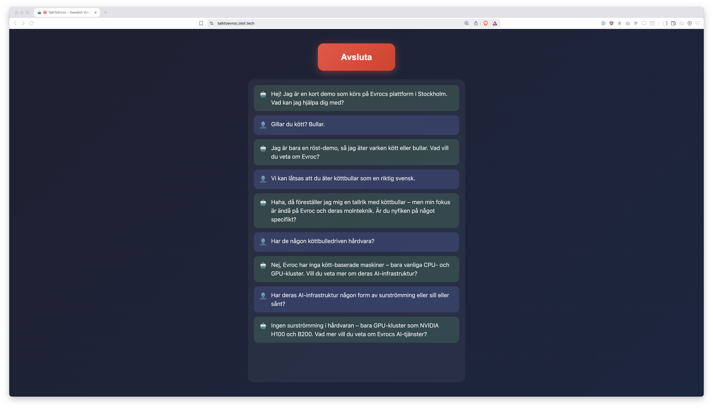

# TalkToEvroc

A real-time Swedish voice assistant demo built with [Pipecat](https://github.com/pipecat-ai/pipecat) and [Evroc](https://evroc.com/) cloud services.

🎙️ **[Try the live demo →](https://talktoevroc.olof.tech)**



## What is this?

This project demonstrates how to build a low-latency, real-time voice agent using:

- **Speech-to-Text**: [KBLab kb-whisper-large](https://huggingface.co/KBLab/kb-whisper-large) - Swedish Whisper model running on Evroc
- **LLM**: GPT-OSS-120B via Evroc Think Models
- **Text-to-Speech**: [Piper TTS](https://github.com/rhasspy/piper) with Swedish NST voice from [KB-labb](https://kb-labb.github.io/posts/2023-05-24-swedish-text-to-speech/)
- **Framework**: [Pipecat](https://github.com/pipecat-ai/pipecat) for real-time voice AI pipelines
- **Transport**: WebSocket with Protobuf serialization for browser connectivity

The voice assistant speaks Swedish and can answer questions about Evroc, European cloud infrastructure, and general topics.

## Architecture

```
Browser (React) ←WebSocket→ FastAPI Server ←→ Pipecat Pipeline
                                                    ↓
                                    ┌───────────────┼───────────────┐
                                    ↓               ↓               ↓
                               Evroc STT      Evroc LLM       Piper TTS
                            (kb-whisper)    (GPT-OSS-120B)   (Swedish NST)
```

## Prerequisites

- Python 3.12+
- [uv](https://docs.astral.sh/uv/) (Python package manager)
- [Bun](https://bun.sh/) or Node.js (for frontend)
- Evroc API keys for STT and LLM services

## Setup

### 1. Clone the repository

```bash
git clone https://github.com/oloflarsson/TalkToEvroc.git
cd TalkToEvroc
```

### 2. Set environment variables

```bash
export EVROC_API_KEY_STT="your-stt-api-key"
export EVROC_API_KEY_LLM="your-llm-api-key"
```

### 3. Run locally

The easiest way to run locally for development:

```bash
./commands/talktoevroc-start
```

This starts:
- Piper TTS server on `http://localhost:5000`
- Backend API on `http://localhost:7860`
- Frontend dev server on `http://localhost:5173`

Visit `http://localhost:5173` in your browser.

### Alternative: Docker

Build and run with Docker:

```bash
# Build (includes frontend)
./commands/talktoevroc-build

# Run
./commands/talktoevroc-run
```

Visit `http://localhost:7860`.

## Project Structure

```
├── app/
│   ├── bot.py          # Pipecat voice pipeline
│   └── server.py       # FastAPI WebSocket server
├── client/
│   └── src/            # React frontend
├── commands/           # Development scripts
├── config/
│   └── deploy.yml      # Kamal deployment config
├── Dockerfile
└── entrypoint.sh       # Container entrypoint
```

## Deployment

The project uses [Kamal](https://kamal-deploy.org/) for deployment. See `config/deploy.yml` for configuration.

```bash
./commands/talktoevroc-deploy
```

## License

MIT License - see [LICENSE](LICENSE) for details.

## Acknowledgments

- [Evroc](https://evroc.com/) for European cloud infrastructure and AI services
- [Pipecat](https://github.com/pipecat-ai/pipecat) for the voice AI framework
- [KBLab](https://kb-labb.github.io/) for Swedish language models
- [Piper](https://github.com/rhasspy/piper) for local TTS
